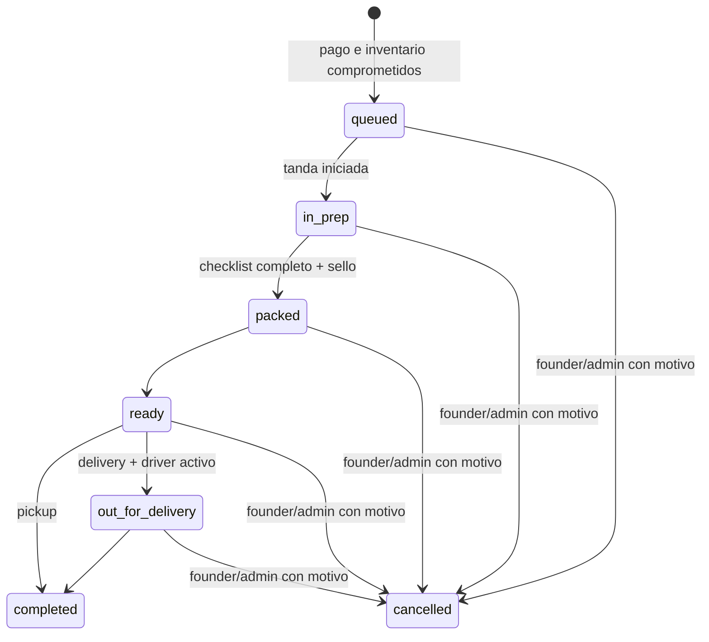

# DEIPO OS — Sprint 04A: Operations & Fulfillment Foundation

Checkpoint local del 2026-10-05 (trabajo iniciado el 2026-10-04, Guatemala). Base: `origin/main` actualizado a
`67099f7d847764941412900296cb938c88c989a0`, Sprint 03 CLOSED / Sandbox accepted.
Rama: `feat/deipo-os-sprint-04-operations`. Solo 04A: sin push, PR, deploy,
migraciones remotas, activación LIVE ni cambios de datos de Producción.

## Propósito y límites de dominio

Operar cada pedido pagado desde cola hasta una resolución terminal, con tandas,
checklist, responsables e incidencias independientes. Objetivos de lanzamiento:
sold out del cupo real del drop (referencia 80 unidades), cero pedidos perdidos,
cero sobreventa y al menos 95% de entregas a tiempo. El dashboard no inventa estos
resultados ni presenta on-time como un KPI ya calculado.

- `payment_attempts` / `payment_webhook_events`: hechos del proveedor y resolución del pago.
- `orders` / `order_items`: pedido y snapshots comerciales inmutables.
- `drop_inventory` / holds / marcas de compromiso: única verdad de inventario.
- `order_fulfillment` y su historial: ejecución operativa. Cancelar aquí no cambia
  pago, inventario, importes, dirección original ni equivale a reembolso.

No se modifican 001–018, el finalizador de pagos, sus wrappers, el checkout,
`requireAdmin()`, el proxy de entrada Admin ni el storefront. El enlace nuevo en
Admin se ajusta en varias líneas en móvil y conserva blancos táctiles de 44px.

## Creación exactamente una vez y locks

Se eligió aprovisionamiento lazy mediante `ops_provision`, integrado en
`ops_queue` para founder/admin/fulfillment y en el Command Center del founder.
Cocina y driver consultan proyecciones; no aprovisionan por su cuenta.

Requisitos comprobados dentro de la transacción:

1. `orders.status = paid`.
2. `inventory_committed_at IS NOT NULL` y `inventory_released_at IS NULL`.
3. Existe un attempt `succeeded` con resolución `committed`.
4. La fila de `orders` se bloquea antes de comprobar elegibilidad y crear la ficha.
5. `UNIQUE(order_id)` y el lock retornan el mismo fulfillment ante replays.
6. Ficha, snapshot de checklist y evento `provisioned` se confirman juntos.

Un webhook duplicado no crea fichas operativas: el código de pagos se mantiene
intacto. Un pedido ya pagado antes de 019 también se reconcilia al abrir la cola.
Un pago concurrente que ya bloqueó el pedido hace esperar al aprovisionamiento;
tras su commit, se observa el estado confirmado. Si todavía está impago, se
rechaza y una consulta posterior puede reintentar. No se cachea esa reconciliación.

Lock de operaciones: advisory transaccional por drop, luego pedido, luego ficha.
Los writes de tandas y asignaciones usan el mismo lock de operaciones. Nunca
adquieren después los locks de inbox/session/drop/hold del motor de pagos. Así no
se invierte el orden de Sprint 03 (inbox → session → drop → hold → order → attempt).
El usuario y asignación del driver se vuelven a comprobar después de esperar.
Cambios de acceso usan un advisory independiente por usuario para evitar mezclar
perfiles Admin/staff bajo concurrencia.

Tradeoff deliberado: la ficha física aparece al reconciliar Operaciones, no en
el commit del pago. Antes de usar Cocina, founder/fulfillment debe abrir la cola.
Una reconciliación programada/outbox podría añadirse después; no se presenta 04A
como operación autónoma ni como garantía de puntualidad en Producción.

## Máquina de estados



Estados exactos: `queued`, `in_prep`, `packed`, `ready`, `out_for_delivery`,
`completed`, `cancelled`. `issue` nunca es un estado principal.

- `ops_transition` exige versión esperada. Un write concurrente obsoleto falla.
- Pickup no puede ir a reparto. Delivery normalmente exige reparto antes de completar.
- Para preparar se necesita una tanda iniciada y no terminada.
- PACKED exige al menos un componente, todas las cantidades requeridas comprobadas
  por una persona y `p_sealed = true`. Se registran `sealed_at` y `sealed_by`.
- El checklist es un snapshot por pedido: cantidad comprada × unidades por componente.
  Los componentes se configuran explícitamente una vez por drop; no hay receta ficticia.
  Si ya hay pedidos queued sin plan, la primera configuración les agrega el plan
  atómicamente con evento. Una vez configurado no se reemplaza silenciosamente.
- Fuera de `in_prep` no se pueden cambiar comprobaciones de packing.
- Overrides founder/admin, con motivo obligatorio, permiten volver a `queued` o
  `in_prep`, o cancelar. Volver a preparación/cola invalida sello y checklist para
  exigir nueva comprobación. No reabre estados terminales ni permite saltar packing.
- Cancelación normal requiere cutoff configurado y vigente. Cutoff ausente o vencido
  exige override explícito; no se interpreta null como cancelación ilimitada.
- `completed` y `cancelled` son terminales. No hay auto-refund ni reposición automática.

## RBAC y PII

Se conserva `admin_profiles` y su semántica histórica. `operator_profiles` separado
contiene exactamente `kitchen`, `fulfillment`, `driver`, con activo/inactivo,
inviter, timestamps y auditoría. `ops_set_operator` solo permite founder/admin.
El usuario debe existir en Auth; el aprovisionamiento de cuentas se realiza por
invitación administrativa. No hay autoasignación por signup, primer usuario,
correo o metadata. Tampoco UI de invitaciones en 04A. Antes de lanzamiento debe
validarse la configuración invite-only de Supabase Auth y el flujo de login staff.

Un trigger rechaza pertenencia simultánea a las dos tablas, incluso si un perfil
está inactivo. El `operator` histórico de Admin NO se convierte en kitchen ni obtiene
permisos nuevos. Una migración futura de cuentas entre dominios necesita un
procedimiento explícito que conserve su historial.

| Actor | Lectura | Mutaciones 04A |
|---|---|---|
| Founder | Command Center, operación completa, PII necesaria y Admin comercial existente | Todo el motor, acceso, configuración y overrides auditados |
| Admin | Operación completa, PII necesaria y Admin comercial existente | Igual motor; Command Center restringido a founder |
| Kitchen | Código, producto, cantidad, estado, tanda, tiempos, checklist, número de incidencias; conteos de producción | Crear/asignar/iniciar/completar tandas, registrar producción, queued → in_prep |
| Fulfillment | Cola y logística necesaria, checklist e incidencias/timeline | Aprovisionar, packing, ready, reparto/handoff, asignar driver, abrir/resolver incidencias |
| Driver | Solo fichas asignadas actualmente; nombre/teléfono/dirección/referencia/pin necesarios | ready → out_for_delivery → completed; abrir/resolver incidencias asignadas |
| Cliente | Código, producto, cantidad, estado operativo, método y horario de su ficha | Ninguna |
| Anónimo / inactivo / usuario sin perfil | Ninguna operación | Ninguna |

Kitchen nunca recibe teléfono, email, dirección, pago, proveedor, revenue ni raw
metadata de eventos. Driver no recibe `order_id`, pago, revenue ni pedidos de otros
drivers. No se copia PII en tablas de staff: los RPCs proyectan desde el snapshot
comercial. Solo los overrides logísticos explícitos contienen datos nuevos.
La pantalla founder usa código/producto/estado/tanda, sin renderizar contacto.

Todas las tablas nuevas tienen RLS activado, sin grants directos a anon,
authenticated o service_role. La autorización y proyección se realizan en funciones
privadas SECURITY DEFINER con `search_path = ''`; los wrappers públicos son
SECURITY INVOKER y tienen grants de ejecución explícitos. Service role solo recibe
el RPC nuevo de lectura del tracker. Las mutaciones usan JWT de la sesión de staff.

## Esquema exacto

019 crea estas 12 tablas (todas las FK tienen índices por PK, unique o índice explícito):

| Tabla | Persistencia principal |
|---|---|
| `operator_profiles` | user_id, role, is_active, invited_by, created_at/updated_at |
| `drop_operations_config` | drop_id, cancellation_cutoff_at, prep_lead_minutes, delivery_lead_minutes, pickup_grace_minutes, updated_by/at |
| `drop_packing_components` | drop_id, code, label, units_per_item; unique(drop_id, code) |
| `production_waves` | drop_id, sequence, planned_units, target_ready_at, started_at, completed_at, created_by/at |
| `order_fulfillment` | unique order_id, status, wave_id, version, seal actor/time, completed_at/cancelled_at, created_at/updated_at |
| `fulfillment_events` | identity id, fulfillment_id, event_type, from/to, actor, reason, metadata, created_at; append-only |
| `fulfillment_packing_checks` | fulfillment_id, component_code/label, required_quantity, checked_quantity, checked_by/at |
| `fulfillment_issues` | fulfillment_id, reason, open/resolved, opened_by/at, resolved_by/at, resolution |
| `delivery_assignments` | fulfillment_id, driver_user_id, assigned_by/at, ended_at, reason; una asignación activa |
| `production_adjustments` | wave_id, produced/waste/damaged/replacement, quantity, unique request_id, actor, reason, created_at; append-only |
| `fulfillment_logistics_overrides` | fulfillment_id, revision identity, address, guatemala_zone, instructions, optional lat/lng, actor/time/reason; append-only |
| `customer_order_access` | fulfillment_id PK, unique token_hash, expires_at, revoked_at, created_by/at |

Además: `drop_slots.max_units` nullable, sin valor de lanzamiento. El `capacity`
existente conserva sus valores y se documenta como `max_orders` logístico; no se
crea una segunda tabla de horarios. `drop_delivery_zones` existente conserva
code/label/fee/is_enabled; no se duplican zonas ni se implementa pricing por km.
No se crean fixtures comerciales en ninguna migración.

Eventos exactos: `provisioned`, `transition`, `state_override`, `wave_assigned`,
`packing_checked`, `packing_plan_set`, `issue_opened`, `issue_resolved`,
`driver_assigned`, `logistics_override`, `access_rotated`, `access_revoked`.
La configuración/staff/tandas también escriben el `audit_log` existente. Las
correcciones logísticas conservan todos los overlays y el snapshot original de
`orders`; la revisión identity define el último overlay incluso dentro del mismo
transaction timestamp. Los eventos referencian el override sin duplicar dirección.

Conteos de producción son hechos físicos positivos, separados de las ventas y el
inventario. `request_id` evita duplicarlos al reintentar; payload distinto con
la misma clave falla. Las asignaciones no exceden `planned_units` de una tanda,
incluso bajo concurrencia. `planned_start_at = target_ready_at - prep_lead_minutes`
solo se calcula si se configuró lead time. Sin duración de receta predeterminada.

## RPCs y funciones

020 expone 22 RPCs nuevos con implementaciones privadas del mismo nombre:

| Grupo | RPCs públicos |
|---|---|
| Autorización/configuración | `ops_current_role`, `ops_set_operator`, `ops_configure_drop`, `ops_update_schedule` |
| Ciclo/packing | `ops_provision`, `ops_transition`, `ops_check_packing` |
| Producción | `ops_create_wave`, `ops_wave_action`, `ops_assign_wave`, `ops_record_production` |
| Logística/incidencias | `ops_assign_driver`, `ops_open_issue`, `ops_resolve_issue`, `ops_override_logistics` |
| Acceso cliente | `ops_rotate_access`, `ops_revoke_access`, `ops_customer_tracker` |
| Lecturas | `ops_queue`, `ops_waves`, `ops_timeline`, `ops_command_center` |

Helpers privados sin execute directo: `ops_role`, `ops_require`, `ops_reason`,
`ops_drop_lock`, `ops_lock`, `ops_can_access`, `ops_event`; trigger helper de 019:
`ops_profile_separation`. Los argumentos exactos están en SQL y en
`src/types/database.types.ts`. Los tipos nuevos son aditivos al snapshot 018;
no se afirma que hayan sido generados desde Producción con 019 aplicada.

Repositorios server-only: Command Center, queue tipada por rol esperado,
production waves y dispatcher de mutaciones tipadas con JWT. El rol esperado se
vuelve a validar dentro de `ops_queue`, sin confiar en una comprobación anterior.
No se exponen aún Server Actions ni endpoints de mutación operativa.

## QR y acceso customer-safe

32 bytes de `crypto.randomBytes` codificados base64url (43 caracteres, 256 bits).
El token no contiene UUID, teléfono, email ni PII; SHA-256 es lo único persistido.
Founder/admin puede emitir/rotar/revocar; la respuesta server-only entrega el token
una vez al futuro flujo autorizado. Expiración explícita obligatoria, sin duración
inventada. Rotación invalida el token anterior y registra actor/time en eventos.

`readCustomerTracker` valida formato, hace hash en servidor y usa un RPC exclusivo
de service_role que retorna una whitelist sin UUID interno, contacto, dirección,
importes, incidencias internas o detalles de pago. El token no representa una
sesión Auth y no aparece en firmas de RPCs de mutación. El código corto existente
`D-…` se conserva como referencia humana; nunca autentica al cliente.

04A no genera imagen QR, no añade `/order/<token>` ni envía mensajes. Antes de
exponer esa ruta en 04C/04D: `Cache-Control: no-store`, `Referrer-Policy: no-referrer`,
exclusión de analytics y redacción del token en logs de aplicación/infraestructura.
El checkout token no se reutiliza ni se coloca en URLs. No se registra PII/tokens
con console, audit metadata de acceso, analytics o errores de repositorio.

## Incidencias, cancelación y promesas de entrega

Razones exactas: `customer_unreachable`, `address_issue`, `missing_item`,
`damaged_order`, `late`, `delivery_failed`, `pickup_no_show`, `other`.
Ciclo `open → resolved`; el segundo resolve no genera otro evento. Pueden coexistir
con cualquier estado operativo y no modifican pago o snapshot comercial.

Pickup no-show requiere pickup, slot_end conocido, plazo de gracia transcurrido
(default operativo 30 minutos) y ficha no terminal. Solo permite abrir incidencia;
no automatiza detección, cancelación ni reembolso.

La política comercial confirmada es corte 24 horas antes del fulfillment/drop.
Debe configurarse `cancellation_cutoff_at` desde la fecha/promesa real; 04A no inventa
fecha ni calcula un corte desde medianoche cuando no hay horario definido. Cambiar
el corte requiere founder/admin con motivo y registro de valor anterior/nuevo.
No hay cancelación pública por tracker; solicitudes de cliente/reembolsos se
resolverán en fases posteriores, respetando el corte.

Ventanas previstas 18:00–19:00, 19:00–20:00 y 20:00–21:00, America/Guatemala:
son promesas al cliente, no tandas. Referencia logística: aproximadamente 35
PEDIDOS por horario, independiente de 80 UNIDADES de referencia por drop. El
checkout Sprint 02 aún no garantiza cupo transaccional por slot; 04A no lo cambia
ni afirma que max_units esté configurado. Debe resolverse antes de lanzar.

Pickup: lobby en Zona 10. Delivery propio: Zonas 10/14/15 incluidas; extras externos
explícitos por zona y zonas no soportadas deshabilitadas. Son decisiones de negocio,
no seeds de Producción. Direcciones y pin opcional tienen soporte operativo;
checkout original sigue inmutable y no agrega solicitudes libres de comida.

## Command Center

`/admin/operations`, founder-only tanto en DAL como SQL. CURRENT real desde
storefront_config; sold desde drop_inventory, pagados y estados operativos desde
DB, incidencias abiertas y atraso activo cuando ya terminó la ventana prometida.
No cuenta incidencias `late` como si fueran un estado ni inventa un porcentaje SLA.
Sin CURRENT muestra vacío; error de DB muestra error, nunca métricas simuladas.
Actualización explícita con `router.refresh()`, sin polling o cron nuevos.

Cream/black/orange existentes, español, formato Guatemala 24h, navegación móvil
sin overflow, accesibilidad WCAG A/AA automatizada. Sin cambios al storefront.

## Migración y validación

- `20261005050000_019_operations_domain.sql`: schema, RLS, índices, constraints,
  separación de perfiles y triggers de inmutabilidad.
- `20261005051000_020_operations_engine.sql`: ciclo, RBAC, DTOs, RPCs y grants.
- Read-only remoto: Producción está en PostgreSQL 17.6 y termina en018; el timestamp
  remoto018 es `20261001040748`, distinto del archivo local de aceptación, con el
  mismo SQL MD5 `bc2a56fcb2f7c3813dc3ce52c784775a`. Se conserva el historial.
- Read-only remoto: cero drops con ordering habilitado, CURRENT/NEXT null; no existe
  esquema operativo previo equivalente. No se inspecciona ni modifica PII remota.
- Runtime de pruebas instalado solo bajo `/private/tmp`. Sin recurso externo pago;
  `deipo-os-acceptance` y Producción nunca son destinos de pruebas/migración.
- Aplicación local inicial desde base vacía sobre PostgreSQL 18.4; verificación final
  desde base vacía y regresiones también en PostgreSQL 17.6.

Validación final (Node **22.22.1**):

| Validación | Resultado |
|---|---|
| Migraciones desde DB vacía PostgreSQL 17.6 | 001–020 aplicadas; 21 archivos incluyendo los dos 005 históricos |
| Sprint 01 | Regresión SQL existente aprobada |
| Sprint 02 | 78 assertions, 2 carreras con conexiones independientes |
| Sprint 03 | 279 assertions, 9 carreras con conexiones independientes |
| Sprint 04A | 364 assertions, 6 carreras con bloqueo probado en pg_stat_activity |
| Unitarias generales | 45/45 |
| Proveedor/firma/origen pagos | 80/80 |
| Tokens operativos | 2/2, incluyendo 1,000 tokens aleatorios y rechazo de códigos/PII |
| Navegador Admin | 17/17; 14 regresiones y 3 OPS; WCAG A/AA y 390/1440px |
| Navegador checkout/pagos | 18/18 |
| Command Center PostgreSQL 17.6 | Tres casos OPS repetidos contra el esquema final |
| TypeScript / lint | Aprobados, sin errores |
| Build Next producción | Webpack, Node 22.22.1, SITE_MODE=production, aprobado |
| Secret scan | 19 archivos cambiados/nuevos + 120 archivos compilados; 0 hallazgos |

Las seis carreras OPS: provisión duplicada, pago vs provisión, transición con
versión duplicada, asignaciones que compiten por cupo de tanda, conteo de producción
con request_id duplicado y reasignación de driver mientras el driver previo espera.
Los resultados no son simulaciones secuenciales; se confirma espera de lock antes
de liberar la primera transacción. Inventario/pagos se comparan antes/después de
incidencias, overrides y cancelación operativa y permanecen idénticos.

SHA-256 de migraciones finales:

- 019: `46663e70b2d498dfab8e4fd3daeceab4e8f5923c299aa9d4ffdaad6d6cba6f70`.
- 020: `cf2b3062cec77a3ec040ee81c054f4428f2c3911db13ba4ef016f3c50f09dbe7`.

Secret scan propio por patrones de credenciales/proveedor/private-key y comparación
con valores privados locales (sin imprimirlos). Incluye bundles cliente/servidor;
no sustituye un scanner de secretos del hosting ni una aceptación remota.

Archivos entregados (19):

- `AGENTS.md`, `package.json`, `docs/deipo-os-sprint-04.md`.
- Las dos migraciones019/020 de la tabla anterior.
- `src/types/database.types.ts`.
- `src/lib/deipo/operations.ts`, `src/lib/deipo/customer-access.ts`,
  `src/lib/deipo/repositories/operations.ts`.
- `src/app/admin/(protected)/operations/page.tsx`,
  `src/components/admin/refresh-operations.tsx`,
  `src/app/admin/(protected)/layout.tsx`, `src/app/admin/admin.css`.
- `scripts/test-operations-db.mjs`, `tests/operations.test.ts`,
  `tests/operations/access.test.ts`, `tests/admin-browser/operations.spec.ts`,
  `tests/fixtures/operations-db.mjs`, `tests/fixtures/supabase-http.mjs`.

Checkpoint de Git: commit local de esta documentación y código en la rama indicada.
El SHA exacto se registra en Wichiss y en la entrega; no se añade autorreferencia
circular al commit. Ninguna migración aplicada remotamente; main remoto conserva
67099f7. El entorno de aceptación no se consultó, repurposó ni eliminó.

Comandos reproducibles (Node 22 en PATH; `DEIPO_TEST_DATABASE_URL` solo loopback,
base vacía exclusiva; no usar acceptance):

```sh
node scripts/setup-orders-test-db.mjs
npm run test:db
npm run test:payments:db
npm run test:operations:db
npm test
npm run test:payments
npm run test:operations
npm run test:admin
npm run test:checkout
npm run lint
npm run typecheck
NEXT_PUBLIC_SITE_MODE=production npm run build
```

`test:operations:db` deja únicamente fixtures locales de las carreras para el
bridge de navegador. `test:admin` ejecuta las tres pruebas OPS con esa variable;
sin DB las omite explícitamente, sin sustituir métricas inventadas. El bridge
abre transacción, consulta RPC real y hace rollback. Auth HTTP es un fixture local,
no Supabase Auth/Storage real. Al terminar, detener el cluster local dedicado.

Hallazgos resueltos durante validación: nombres ambiguos de variables SQL,
serialización JSON de arrays en el harness, expectativas de ceros de fecha según
ICU, aislamiento de imports de Next en tests de tokens y overflow del menú móvil.
Las suites finales usan constraints reales; no se desactivaron triggers ni RLS.
La advertencia de imágenes loopback/SSRF del fixture checkout se conserva sin
relajar las protecciones de producción; no valida almacenamiento remoto real.

## Pendientes y alcance siguiente

No avanzar automáticamente. 04B/04C/04D: Kitchen Mode, Packing Station, scanner/QR,
login e invitaciones UI de staff, Driver Mode, tracker público, impresión,
WhatsApp manual, reporte de cierre y aceptación runtime tras release autorizado.
WhatsApp Cloud API sigue Sprint 05. No dynamic Q/km, launch date, precio final,
menú inventado, food customization libre, refund automation ni LIVE.

Falta confirmar/configurar: drop real/capacidad, precios, menú/componentes por
unidad y plan de packing, fechas/cutoff, cupos por slot y enforcement, zonas/fees,
lead times, tandas, usuarios invitados y drivers, expiración/retención de acceso y
PII, proceso de cambios de recipe plan, y resolución financiera de cancelaciones.
La aceptación local no equivale a migración ni aceptación operativa remota.
